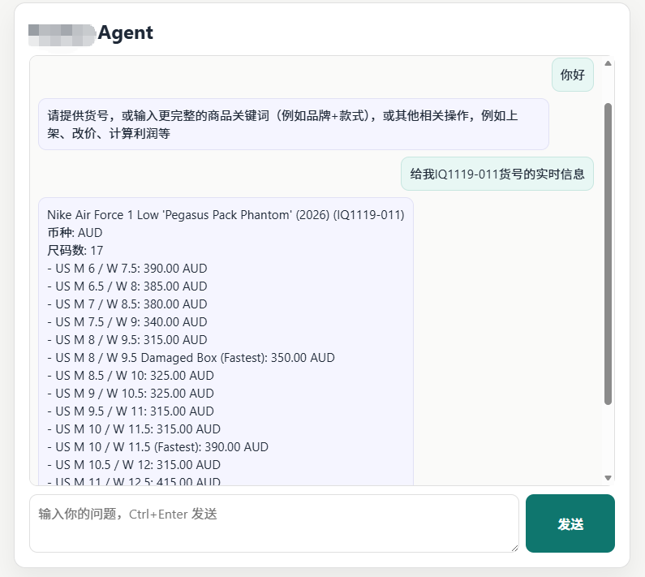

# 电商运营 Agent（公开展示版）

这是一个用于项目展示与客户沟通的公开仓库版本。  
为保护商业机密，本仓库仅展示架构设计、功能说明与 API 交互方式，不包含核心业务源码与生产策略。

## 示例界面

## 项目能力

1. 对话式查询路由（库存 / 市场信息）
2. 双平台价格对比与利润筛选（支持导出报表）
3. 上架、改价等运营操作的流程化草稿生成（演示模式，不执行真实动作）
4. 基于 RAG 的商品检索与信息召回

## 技术方向

- 后端服务：FastAPI 风格接口编排
- Agent 能力：工具化路由 + 结构化 `tool_calls`
- 检索系统：Embedding + 向量检索 + Rerank + TF-IDF 回退
- 数据输出：结构化结果 + CSV 下载链路
- 前端集成：可通过浏览器页面或业务面板接入

## 文档目录

- `docs/ARCHITECTURE.md`：系统架构与工作流
- `docs/FEATURES.md`：核心功能模块说明
- `docs/API_CONTRACT.md`：接口契约与请求示例
- `docs/SECURITY_AND_SCOPE.md`：公开范围与安全声明
- `docs/RESUME_DESCRIPTION.md`：简历项目描述示例

## 说明

该仓库用于公开展示项目能力。如需深度合作或定制化方案，可进一步沟通。
