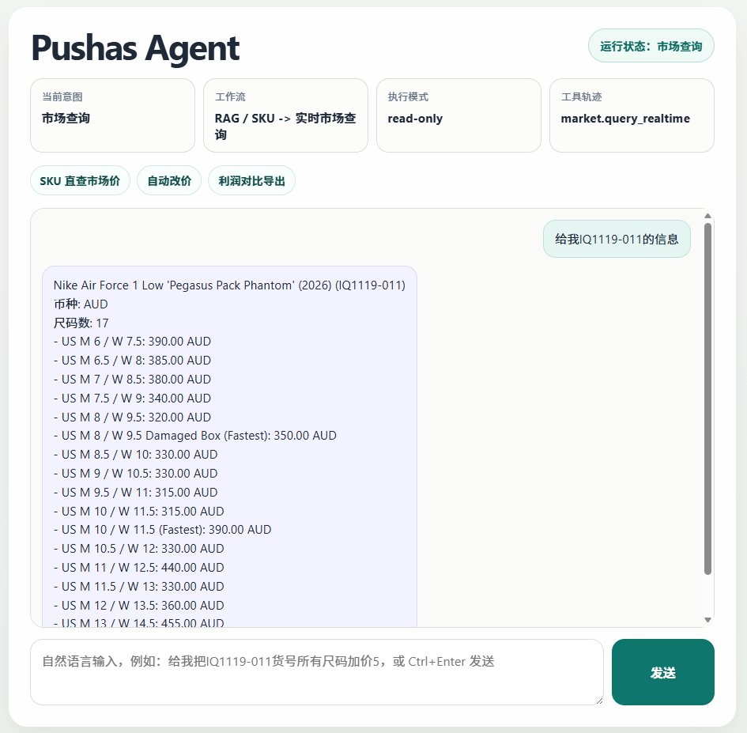
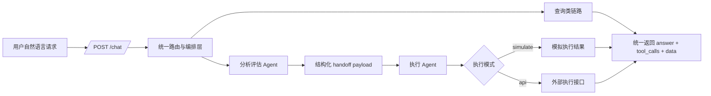

# 电商运营 Multi-Agent

一个面向电商运营场景的对话式 Multi-Agent 项目展示版。  
它把“查市场价、查库存、双平台利润分析、上架、改价”等动作统一到一个对话入口中，并通过 **分析评估 Agent -> 执行 Agent** 的双阶段工作流，实现更清晰、更安全、也更接近真实业务系统的自动化流程。

本仓库用于项目展示、客户沟通与简历作品集。  
为保护商业机密，公开版仅保留架构设计、接口契约、展示页面与功能说明，不包含核心业务源码与生产策略。

## 示例界面

## 这个项目解决了什么问题

传统电商运营动作往往分散在多个页面和脚本中，人工切换频繁、判断链路不透明。  
这个项目的目标是把“查询、分析、执行”统一到一个自然语言入口里，并且让系统能明确回答：

- 这次请求属于什么业务意图
- 应该调用哪个 Agent 和哪类工具
- 是否具备执行条件
- 当前是在模拟执行，还是已接入真实接口

## 多 Agent 架构

### 1. 分析评估 Agent

- 识别用户意图：查询、利润对比、上架、改价
- 抽取 SKU、价格、尺码等关键参数
- 评估操作风险与参数完整性
- 生成结构化 handoff payload

### 2. 执行 Agent

- 接收分析阶段的 handoff
- 根据策略执行 `simulate` 或 `api` 模式
- 返回执行状态、工具轨迹与审计信息

### 3. 检索与数据能力

- RAG 检索负责 SKU/商品召回
- 市场查询负责实时价格与尺码信息
- 双平台对比负责利润筛选与报表导出

## 工作流

## 核心能力

1. SKU 直查与关键词召回，支持市场价与库存信息查询
2. 双平台价格对比、利润阈值筛选与 CSV 报表导出
3. 多 Agent 上架 / 改价流程：分析、评估、交接、执行全链路可追踪
4. 重型 RAG 检索链路：Embedding + Vector Store + Rerank + TF-IDF Fallback
5. 展示页可直接演示多 Agent 状态、执行模式与工具调用轨迹

## 技术亮点

- **后端服务**：Python、FastAPI
- **Agent 编排**：Multi-Agent Orchestrator、结构化 `tool_calls`、handoff payload
- **检索系统**：Embedding、向量检索、Rerank、TF-IDF 回退
- **数据能力**：库存快照、市场商品数据、第二平台 API、CSV 导出
- **执行策略**：`simulate` 演示模式 + `api` 扩展模式
- **展示层**：HTML / CSS / JavaScript 本地演示页

## 对外展示价值

这个项目不只是“能聊天”的 Agent，而是一个更接近业务自动化系统的作品：

- 既能展示 Agent 编排能力，也能展示后端接口设计能力
- 既有查询与 RAG，也有执行链路与安全边界
- 既适合放在简历上，也适合面向客户做能力展示

## 文档目录

- `docs/ARCHITECTURE.md`：系统架构与分层设计
- `docs/MULTI_AGENT_WORKFLOW.md`：多 Agent 工作流与执行链路
- `docs/FEATURES.md`：功能模块拆解
- `docs/API_CONTRACT.md`：接口契约与返回结构
- `docs/SECURITY_AND_SCOPE.md`：公开范围与安全说明
- `docs/RESUME_DESCRIPTION.md`：简历项目描述模板

## 说明

该仓库是公开展示版。  
如果需要进一步扩展成真实执行系统，可在当前架构上继续接入权限控制、审批机制、审计日志与正式执行接口。
